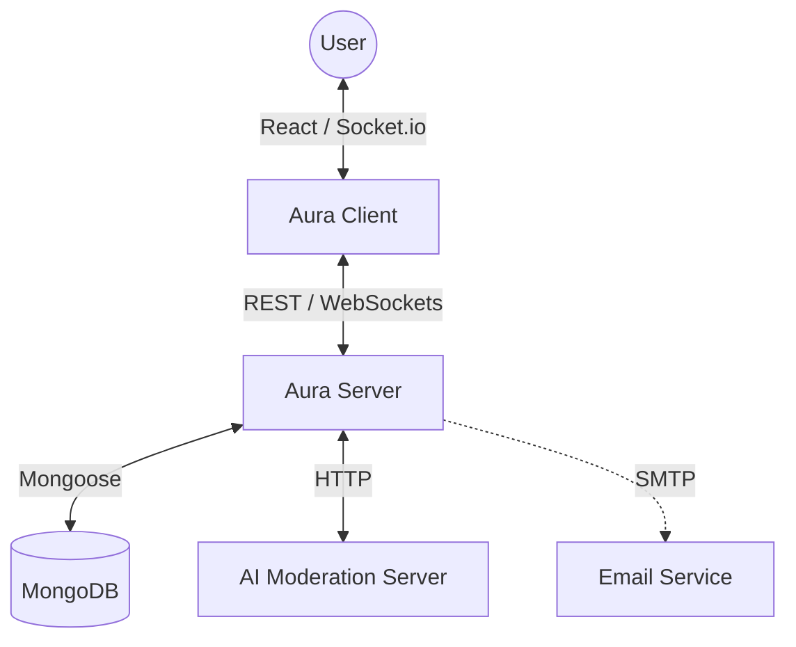

# 🌟 Aura — Social Experience Reimagined

[](https://github.com/aarogyaojha/mySocialSpace/actions)
[](https://opensource.org/licenses/MIT)
[](http://makeapullrequest.com)

**Aura** is a premium, full-stack social networking platform designed for high-end engagement. Inspired by Reddit, it features a robust MERN architecture, real-time interactions, and a "WOW" UI/UX with dark mode and nested discussions.

> [!IMPORTANT]
> This project was formerly known as `mySocialSpace`. It has been rebranded to **Aura** with a full technical overhaul, Reddit-style features, and a premium modern aesthetic.

---

## ✨ Key Features

### 🗳️ Reddit-Style Engagement
- **Advanced Voting**: Upvote/downvote system with optimistic UI and color-coded score tracking.
- **Threaded Discussions**: Infinite recursive comment nesting with visual thread lines and collapsible branches.
- **Smart Sorting**: Home and Community feeds with **Hot**, **New**, **Top**, and **Rising** algorithms.

### 🎨 Premium UI/UX
- **🌓 Dark Mode**: Persistent theme support with smooth transitions and system preference detection.
- **� Markdown Support**: Full GFM (GitHub Flavored Markdown) rendering for posts and comments.
- **⚡ Shimmer Skeletons**: Content-aware loading states for a seamless perception of speed.
- **🏷️ Badges & Metadata**: NSFW, Pinned, and Locked status indicators with community flairs.

### 🛡️ Security & Scalability
- **🔐 Context-Aware Auth**: Smart login verification based on IP, Location, and Device metadata.
- **🤖 AI Moderation**: Automated content safety checks using a dedicated Python-based classifier server.
- **⚓ Dockerized**: Fully containerized stack for one-command local orchestration.

---

## 🛠️ Technology Stack

| Layer | Technologies |
| :--- | :--- |
| **Frontend** | React 18, Vite, Redux Toolkit, Tailwind CSS, Lucide React, Framer Motion |
| **Backend** | Node.js, Express, MongoDB (Mongoose), Socket.io, Passport.js, JWT |
| **Moderation**| Python (Flask/FastAPI), scikit-learn, Perspective API |
| **Infrastructure**| Docker & Docker Compose, GitHub Actions (CI/CD) |

---

## 🏗️ Architecture Overview



---

## 🚀 Getting Started

### One-Command Setup (Docker)
The easiest way to run the entire Aura stack (Frontend, Backend, Database, AI Moderation):
```bash
docker-compose up --build
```

### Manual Setup

1. **Clone & Install**
   ```bash
   git clone https://github.com/aarogyaojha/mySocialSpace.git
   cd mySocialSpace
   ```

2. **Environment Configuration**
   Copy `.env.example` to `.env` in both `server/` and `client/` directories and fill in your credentials.

3. **Start Components**
   - **Server**: `npm start` (in `server/`)
   - **Client**: `npm run dev` (in `client/`)
   - **Classifier**: `python classifier_api.py` (in `classifier_server/`)

---

## 📄 Documentation

- [Frontend Documentation](client/README.md)
- [Backend Documentation](server/README.md)
- [Contributing Guidelines](CONTRIBUTING.md)
- [License](LICENSE)

---

## � Contributing

We welcome contributions! Please check our [Contributing Guide](CONTRIBUTING.md) for details on how to get started.

---

## ⚖️ License

Distributed under the MIT License. See `LICENSE` for more information.

Developed with ❤️ by **Aarogya Ojha**
